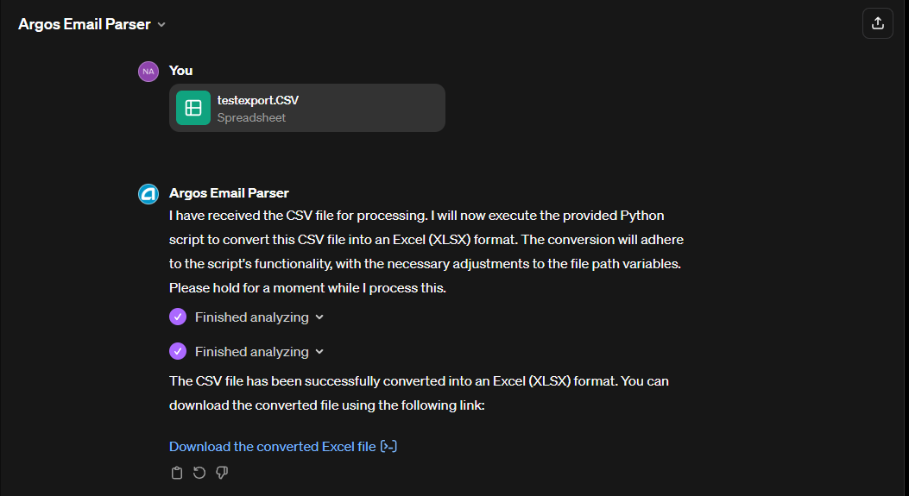

# Argos Email Parser Guide

## Exporting CSV File from Outlook Desktop App

To use the Argos Email Parser effectively, you first need to export your email data from the Outlook desktop app into a CSV file. Here are the steps to do so:

1. Open your Outlook desktop app.
2. Navigate to the folder containing the emails you wish to export.
3. Go to the **File** menu and select **Open & Export**.
4. Click on **Import/Export** to open the Import and Export Wizard.
5. Choose **Export to a file** and click **Next**.
6. Select **Comma Separated Values** and click **Next**.
7. Choose the folder from which you want to export emails and click **Next**.
8. Browse to select the destination folder, name your file, and click **Finish**.

## Using Argos Email Parser

Once you have your CSV file, follow these steps to use Argos Email Parser:

1. Start a new chat with Argos Email Parser at [Argos Email Parser](https://chat.openai.com/g/g-i1Y9G9DgX-argos-email-parser).
2. Upload the CSV file you exported from Outlook.
3. Wait for the parser to process your file and provide insights or data as required.

## Downloadable Resources

Here are some examples of what Argos Email Parser has created:

- [Eco1 Excel File](testexport_V25.xlsx)
- [Fenceline Test Excel File](fencelinetest_V25.xlsx)
- [Eco1deb Test Excel File](eco1debtest_V25.xlsx)
- [Python Script](code.py)

Example document for testing:
[testexport.csv](testexport.CSV)